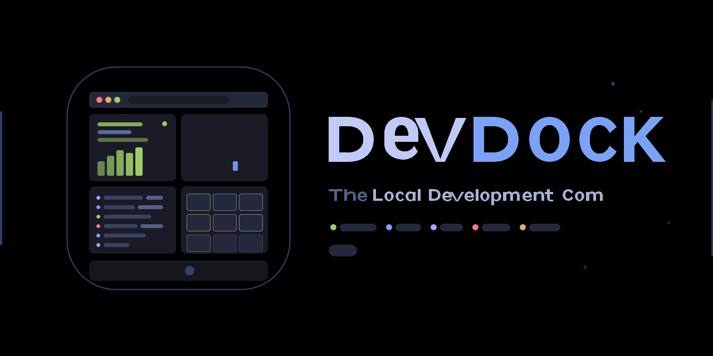

<p align="center">
  
</p>

<p align="center">
  <strong>The Local Development Command Center</strong>
</p>

<p align="center">
  
  
  
  
  
</p>

<p align="center">
  
  
  
</p>

---

DevDock is a cross-platform desktop application that consolidates project management, port monitoring, service orchestration, log aggregation, and resource monitoring into a single, beautifully designed interface. It sits alongside your editor and terminal as a persistent command center for your local development environment.

<p align="center">
  
</p>

## The Problem

Modern developers routinely juggle 5-15 local services across multiple projects. Managing them requires a patchwork of terminal tabs, Activity Monitor, browser bookmarks, and tribal knowledge about which port belongs to what.

- **Port Collisions** — Multiple projects default to the same ports (3000, 8080), causing cryptic startup failures
- **Service Amnesia** — Forgetting which services a project needs, leading to confusing runtime errors
- **Zombie Processes** — Orphaned dev servers consuming CPU/memory that go unnoticed for days
- **Context Switching** — Mentally reconstructing which services, branches, and env files are active
- **Log Fragmentation** — Logs scattered across dozens of terminal tabs with no unified search

## The Solution

DevDock provides a persistent, always-on dashboard that automatically discovers projects, monitors ports, aggregates logs, tracks resource usage, and orchestrates multi-service stacks with a single click.

## Features

### Project Discovery & Management
- **Zero-config auto-discovery** — Point DevDock at your projects directory and it detects frameworks, package managers, scripts, ports, and git state automatically
- **14 frameworks supported** — Next.js, Vite, Angular, SvelteKit, Node.js, Django, FastAPI, Rails, Go, Rust, .NET, Laravel, Docker Compose, Docker
- **One-click lifecycle** — Start, stop, and restart any project with a single click or keyboard shortcut
- **Git integration** — Branch name, ahead/behind remote, dirty file count on every project card

### Port Map & Network Monitor
- **Real-time port scanning** — Live TCP port monitoring with 2-second refresh, platform-native detection (lsof/netstat/ss)
- **Visual port grid** — Color-coded tiles showing managed ports (green), external processes (blue), and conflicts (red)
- **Port conflict detection** — Instantly identify when two projects want the same port
- **One-click kill** — Terminate any process by port number with confirmation

### Unified Log Aggregation
- **Multiplexed streaming** — All process stdout/stderr in one virtualized, searchable view
- **Color-coded by project** — Each project's logs are visually distinguished
- **Level detection** — Auto-detect INFO, WARN, ERROR, DEBUG with level-based filtering
- **High performance** — 60fps rendering with 10,000+ lines via virtualized scrolling
- **Full-text search** — Regex-capable search across all logs

### Resource Monitoring
- **Per-process metrics** — CPU percentage and RSS memory for every managed service
- **Sparkline charts** — Compact trend visualization on project cards
- **Aggregate stats** — Always-visible total CPU, memory, running count, and active ports in the stats bar

### Stack Orchestration
- **Named stacks** — Group related services (frontend + API + database) into a single launch target
- **Ordered startup** — Start services in dependency order with health checks
- **One-click launch** — Spin up your entire development environment instantly

### Command Palette
- **Fuzzy search** — Access any action instantly with `Cmd+K` / `Ctrl+K`
- **Keyboard-first** — Every feature accessible without touching the mouse
- **Smart ranking** — Exact matches, word boundary matches, and substring matches prioritized

### Theming
- **4 built-in themes** — Tokyo Night (default), Tokyo Night Storm, Catppuccin Mocha, GitHub Dark
- **User themes** — Create custom themes via JSON files in `~/.devdock/themes/`
- **Hot-reload** — Theme changes apply instantly, no restart needed
- **24 semantic tokens** — Every visual element responds to theme changes

### MCP Server Integration
- **8 AI-accessible tools** — `list_projects`, `start_project`, `stop_project`, `get_port_map`, `kill_port`, `get_logs`, `launch_stack`, `get_resource_usage`
- **Claude Code / Cursor / Windsurf** — Natural language control of your dev environment
- **Localhost only** — MCP server binds exclusively to 127.0.0.1

## Architecture

```
devdock/
├── src/
│   ├── main/                    # Electron main process
│   │   ├── index.ts             # App entry, window, tray
│   │   ├── services/
│   │   │   ├── ProcessManager   # Spawn/kill/monitor child processes
│   │   │   ├── PortScanner      # Platform-specific TCP port scanning
│   │   │   ├── ProjectDiscovery # Auto-detect projects from filesystem
│   │   │   ├── GitService       # Branch, status, ahead/behind via simple-git
│   │   │   ├── LogAggregator    # Multiplex stdout/stderr from all processes
│   │   │   └── ResourceMonitor  # CPU/memory polling per process
│   │   ├── ipc/                 # Typed IPC handler registration
│   │   ├── db/                  # SQLite schema, migrations, queries
│   │   ├── mcp/                 # MCP server (JSON-RPC over stdio)
│   │   └── tray.ts              # System tray icon + context menu
│   ├── preload/                 # contextBridge typed API (35 methods)
│   ├── renderer/
│   │   ├── components/
│   │   │   ├── ui/              # 9 primitives (Button, Badge, Sparkline, etc.)
│   │   │   ├── layout/          # Shell, Sidebar, TitleBar, StatsBar
│   │   │   ├── projects/        # ProjectCard, ProjectList
│   │   │   ├── ports/           # PortTile, PortGrid, PortDetail
│   │   │   ├── logs/            # LogLine, LogStream (virtualized), LogFilter
│   │   │   ├── stacks/          # StackList, StackEditor
│   │   │   └── command-palette/ # Fuzzy search command palette
│   │   ├── views/               # 5 page-level views
│   │   ├── stores/              # 5 Zustand stores
│   │   ├── themes/              # Theme engine + 4 built-in themes
│   │   ├── hooks/               # useKeyboard, useIPC, useTheme
│   │   └── styles/              # Design tokens + global CSS
│   └── shared/                  # Types, constants, IPC channel definitions
├── tests/                       # Vitest unit + integration tests
└── resources/                   # App icons, tray icons, banner
```

## Tech Stack

| Layer | Technology | Purpose |
|-------|-----------|---------|
| Shell | Electron 33+ | Cross-platform desktop framework |
| Renderer | React 19 + TypeScript 5.7 | Component-based UI |
| Build | Vite 6 + electron-vite 5 | Fast HMR + unified build |
| State | Zustand 5 | Lightweight TypeScript-native stores |
| Styling | Tailwind CSS 4 + CSS Custom Properties | Utility CSS + theming |
| Database | SQLite via better-sqlite3 | Local persistence |
| Git | simple-git | Branch/status without shelling out |
| Process | child_process + tree-kill | Full process tree management |
| Virtualization | @tanstack/react-virtual | 60fps log rendering at 10k+ lines |

## Getting Started

### Prerequisites

- **Node.js** 20+ (22+ recommended)
- **npm** 10+
- **Git**

### Installation

```bash
git clone https://github.com/devdock-app/devdock.git
cd devdock
npm install
```

### Development

```bash
# Start in development mode with HMR
npm run dev

# If on Apple Silicon with Rosetta Node, rebuild native module first:
npm run rebuild:electron
npm run dev
```

### Build

```bash
# Production build (all platforms)
npm run build

# Platform-specific packaging
npm run build:mac      # macOS .dmg
npm run build:win      # Windows .exe
npm run build:linux    # Linux .AppImage + .deb
```

### Testing

```bash
# Run all tests
npm run test

# Type checking
npm run typecheck

# Linting
npm run lint

# If native module is compiled for Electron, rebuild for Node first:
npm run rebuild:node
npm run test
```

## Design System

DevDock uses a comprehensive design token system built on CSS custom properties. Every visual element references semantic tokens, enabling complete theme customization.

### Tokyo Night (Default Theme)

| Token | Value | Purpose |
|-------|-------|---------|
| `--dd-bg` | `#1A1B26` | Application background |
| `--dd-surface-0` | `#16161E` | Deepest surface (sidebar) |
| `--dd-surface-1` | `#1A1B26` | Primary surface (cards) |
| `--dd-surface-2` | `#24283B` | Elevated surface (dropdowns) |
| `--dd-accent` | `#7AA2F7` | Primary interactive color |
| `--dd-status-running` | `#9ECE6A` | Running service indicator |
| `--dd-status-error` | `#F7768E` | Error state |
| `--dd-status-warning` | `#E0AF68` | Warning state |
| `--dd-text-primary` | `#C0CAF5` | Primary readable text |

### Typography

- **UI**: Geist Sans (variable weight)
- **Monospace**: Geist Mono (ports, PIDs, paths, logs, terminal output)

### Spacing

4px base unit scale: `--dd-space-1` (4px) through `--dd-space-10` (40px)

## Keyboard Shortcuts

| Shortcut | Action | Context |
|----------|--------|---------|
| `Cmd/Ctrl K` | Open Command Palette | Global |
| `Cmd/Ctrl 1-4` | Switch view (Projects/Ports/Logs/Stacks) | Global |
| `Cmd/Ctrl ,` | Open Settings | Global |
| `Cmd/Ctrl \` | Toggle Sidebar | Global |
| `J / K` | Navigate up/down in lists | Lists |
| `Space` | Toggle Start/Stop | Project focused |
| `O` | Open in Browser | Project focused |
| `E` | Open in Editor | Project focused |
| `T` | Open Terminal | Project focused |
| `R` | Restart | Project focused |
| `Esc` | Close modal / deselect | Global |

## Creating Custom Themes

Place a JSON file in `~/.devdock/themes/`:

```json
{
  "name": "My Custom Theme",
  "parent": "tokyo-night",
  "colors": {
    "bg": "#1a1a2e",
    "accent": "#e94560",
    "status-running": "#0f3460",
    "text-primary": "#eaeaea"
  }
}
```

Only override the tokens you want to change — everything else inherits from the parent theme. DevDock hot-reloads themes when the file changes on disk.

## MCP Server

DevDock includes a built-in Model Context Protocol server that enables AI coding assistants to query and control your local dev environment.

### Available Tools

| Tool | Description | Example |
|------|-------------|---------|
| `list_projects` | All tracked projects with status | "What projects do I have running?" |
| `start_project` | Start a project by name | "Start the auth-service" |
| `stop_project` | Stop a project by name | "Stop whatever is on port 3001" |
| `get_port_map` | All port bindings | "What's running on port 8080?" |
| `kill_port` | Kill process on a port | "Kill whatever is on port 3000" |
| `get_logs` | Recent logs, filterable | "Show me errors from the last 5 min" |
| `launch_stack` | Launch a named stack | "Spin up the e-commerce stack" |
| `get_resource_usage` | CPU/memory for all services | "Which service uses the most memory?" |

## Security

- **Context Isolation**: `contextIsolation: true`, `nodeIntegration: false`
- **No File Modification**: DevDock never writes to project directories
- **Localhost Only**: MCP server binds exclusively to 127.0.0.1
- **OS Keychain**: OAuth tokens stored via OS-native credential storage
- **CSP**: Strict Content Security Policy in production
- **No Privilege Escalation**: Processes run with user's own permissions

## Performance Targets

| Metric | Target |
|--------|--------|
| Cold start | < 2 seconds |
| Port scan cycle | < 500ms |
| Log rendering (10k lines) | 60fps |
| Memory (idle) | < 150MB |
| Memory (10 services) | < 300MB |
| Theme switch | < 100ms |

## Project Stats

- **71 source files** across main process, preload, renderer, and shared modules
- **35 IPC API methods** bridging main and renderer
- **31 IPC channels** for bidirectional communication
- **4 streaming event channels** for real-time updates
- **13 unit tests** covering the database layer
- **0 TypeScript errors**, **0 lint warnings**
- **~850KB total bundle** (main: 92KB, preload: 5KB, renderer: 743KB JS + 29KB CSS)

## License

MIT

---

<p align="center">
  
  <br />
  <sub>Built with Electron, React, TypeScript, and the Tokyo Night color palette</sub>
</p>
